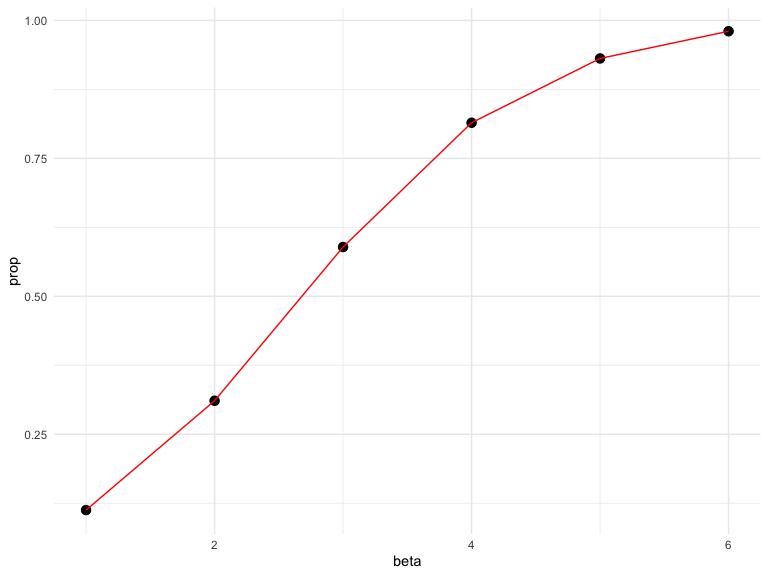

Homework 5 Iteration
================
Keyanna Davis
11/1/2019

Problem 0
---------

This “problem” focuses on structure of your submission, especially the use git and GitHub for reproducibility, R Projects to organize your work, R Markdown to write reproducible reports, relative paths to load data from local files, and reasonable naming structures for your files.

To that end:

-   create a public GitHub repo + local R Project; we suggest naming this repo / directory p8105\_hw3\_YOURUNI (e.g. p8105\_hw3\_ajg2202 for Jeff), but that’s not required
-   create a single .Rmd file named p8105\_hw3\_YOURUNI.Rmd that renders to github\_document

Your solutions to Problems 1, 2, and 3 should be implemented in your .Rmd file, and your git commit history should reflect the process you used to solve these Problems.

For this Problem, we will assess adherence to the instructions above regarding repo structure, git commit history, and whether we are able to knit your .Rmd to ensure that your work is reproducible. Adherence to appropriate styling and clarity of code will be assessed in Problems 1+ using the homework style rubric.

This homework includes figures; the readability of your embedded plots (e.g. font sizes, axis labels, titles) will be assessed in Problems 1+.

Problem 1
---------

The code chunk below loads the `iris` dataset from the `tidyverse` package and introduces some missing values in each column. The purpose of this problem is to fill in those missing values.

``` r
set.seed(10)

iris_with_missing = iris %>% 
  map_df(~replace(.x, sample(1:150, 20), NA)) %>%
  mutate(Species = as.character(Species))
```

-   For numeric variables, you should fill in missing values with the mean of non-missing values

-   For character variables, you should fill in missing values with "virginica"

Write a function that takes a vector as an argument; replaces missing values using the rules defined above; and returns the resulting vector. Apply this function to the columns of iris\_with\_missing using a map statement.

``` r
replace_na_iris = function(x) { 
  
if (is.numeric(x)) {
  replace_na(x, mean(x, na.rm = TRUE))
} else if (is.character(x)) {
  replace_na(x, "virginica")
}
}
iris_wo_missing = map_df(iris_with_missing, replace_na_iris)
```

Problem 2
---------

This zip file contains data from a longitudinal study that included a control arm and an experimental arm. Data for each participant is included in a separate file, and file names include the subject ID and arm.

Create a tidy dataframe containing data from all participants, including the subject ID, arm, and observations over time:

-   Start with a dataframe containing all file names; `the list.files` function will help

``` r
data_files = list.files("./data")
```

-   Iterate over file names and read in data for each subject using purrr::map and saving the result as a new variable in the dataframe

``` r
read_csv_files = function(x) {
  study_data = 
    read_csv(file = str_c("./data/", x)) %>% 
    mutate(file = x)
}

study_data = 
  map_df(data_files, read_csv_files)
```

    ## Parsed with column specification:
    ## cols(
    ##   week_1 = col_double(),
    ##   week_2 = col_double(),
    ##   week_3 = col_double(),
    ##   week_4 = col_double(),
    ##   week_5 = col_double(),
    ##   week_6 = col_double(),
    ##   week_7 = col_double(),
    ##   week_8 = col_double()
    ## )
    ## Parsed with column specification:
    ## cols(
    ##   week_1 = col_double(),
    ##   week_2 = col_double(),
    ##   week_3 = col_double(),
    ##   week_4 = col_double(),
    ##   week_5 = col_double(),
    ##   week_6 = col_double(),
    ##   week_7 = col_double(),
    ##   week_8 = col_double()
    ## )
    ## Parsed with column specification:
    ## cols(
    ##   week_1 = col_double(),
    ##   week_2 = col_double(),
    ##   week_3 = col_double(),
    ##   week_4 = col_double(),
    ##   week_5 = col_double(),
    ##   week_6 = col_double(),
    ##   week_7 = col_double(),
    ##   week_8 = col_double()
    ## )
    ## Parsed with column specification:
    ## cols(
    ##   week_1 = col_double(),
    ##   week_2 = col_double(),
    ##   week_3 = col_double(),
    ##   week_4 = col_double(),
    ##   week_5 = col_double(),
    ##   week_6 = col_double(),
    ##   week_7 = col_double(),
    ##   week_8 = col_double()
    ## )
    ## Parsed with column specification:
    ## cols(
    ##   week_1 = col_double(),
    ##   week_2 = col_double(),
    ##   week_3 = col_double(),
    ##   week_4 = col_double(),
    ##   week_5 = col_double(),
    ##   week_6 = col_double(),
    ##   week_7 = col_double(),
    ##   week_8 = col_double()
    ## )
    ## Parsed with column specification:
    ## cols(
    ##   week_1 = col_double(),
    ##   week_2 = col_double(),
    ##   week_3 = col_double(),
    ##   week_4 = col_double(),
    ##   week_5 = col_double(),
    ##   week_6 = col_double(),
    ##   week_7 = col_double(),
    ##   week_8 = col_double()
    ## )
    ## Parsed with column specification:
    ## cols(
    ##   week_1 = col_double(),
    ##   week_2 = col_double(),
    ##   week_3 = col_double(),
    ##   week_4 = col_double(),
    ##   week_5 = col_double(),
    ##   week_6 = col_double(),
    ##   week_7 = col_double(),
    ##   week_8 = col_double()
    ## )
    ## Parsed with column specification:
    ## cols(
    ##   week_1 = col_double(),
    ##   week_2 = col_double(),
    ##   week_3 = col_double(),
    ##   week_4 = col_double(),
    ##   week_5 = col_double(),
    ##   week_6 = col_double(),
    ##   week_7 = col_double(),
    ##   week_8 = col_double()
    ## )
    ## Parsed with column specification:
    ## cols(
    ##   week_1 = col_double(),
    ##   week_2 = col_double(),
    ##   week_3 = col_double(),
    ##   week_4 = col_double(),
    ##   week_5 = col_double(),
    ##   week_6 = col_double(),
    ##   week_7 = col_double(),
    ##   week_8 = col_double()
    ## )
    ## Parsed with column specification:
    ## cols(
    ##   week_1 = col_double(),
    ##   week_2 = col_double(),
    ##   week_3 = col_double(),
    ##   week_4 = col_double(),
    ##   week_5 = col_double(),
    ##   week_6 = col_double(),
    ##   week_7 = col_double(),
    ##   week_8 = col_double()
    ## )
    ## Parsed with column specification:
    ## cols(
    ##   week_1 = col_double(),
    ##   week_2 = col_double(),
    ##   week_3 = col_double(),
    ##   week_4 = col_double(),
    ##   week_5 = col_double(),
    ##   week_6 = col_double(),
    ##   week_7 = col_double(),
    ##   week_8 = col_double()
    ## )
    ## Parsed with column specification:
    ## cols(
    ##   week_1 = col_double(),
    ##   week_2 = col_double(),
    ##   week_3 = col_double(),
    ##   week_4 = col_double(),
    ##   week_5 = col_double(),
    ##   week_6 = col_double(),
    ##   week_7 = col_double(),
    ##   week_8 = col_double()
    ## )
    ## Parsed with column specification:
    ## cols(
    ##   week_1 = col_double(),
    ##   week_2 = col_double(),
    ##   week_3 = col_double(),
    ##   week_4 = col_double(),
    ##   week_5 = col_double(),
    ##   week_6 = col_double(),
    ##   week_7 = col_double(),
    ##   week_8 = col_double()
    ## )
    ## Parsed with column specification:
    ## cols(
    ##   week_1 = col_double(),
    ##   week_2 = col_double(),
    ##   week_3 = col_double(),
    ##   week_4 = col_double(),
    ##   week_5 = col_double(),
    ##   week_6 = col_double(),
    ##   week_7 = col_double(),
    ##   week_8 = col_double()
    ## )
    ## Parsed with column specification:
    ## cols(
    ##   week_1 = col_double(),
    ##   week_2 = col_double(),
    ##   week_3 = col_double(),
    ##   week_4 = col_double(),
    ##   week_5 = col_double(),
    ##   week_6 = col_double(),
    ##   week_7 = col_double(),
    ##   week_8 = col_double()
    ## )
    ## Parsed with column specification:
    ## cols(
    ##   week_1 = col_double(),
    ##   week_2 = col_double(),
    ##   week_3 = col_double(),
    ##   week_4 = col_double(),
    ##   week_5 = col_double(),
    ##   week_6 = col_double(),
    ##   week_7 = col_double(),
    ##   week_8 = col_double()
    ## )
    ## Parsed with column specification:
    ## cols(
    ##   week_1 = col_double(),
    ##   week_2 = col_double(),
    ##   week_3 = col_double(),
    ##   week_4 = col_double(),
    ##   week_5 = col_double(),
    ##   week_6 = col_double(),
    ##   week_7 = col_double(),
    ##   week_8 = col_double()
    ## )
    ## Parsed with column specification:
    ## cols(
    ##   week_1 = col_double(),
    ##   week_2 = col_double(),
    ##   week_3 = col_double(),
    ##   week_4 = col_double(),
    ##   week_5 = col_double(),
    ##   week_6 = col_double(),
    ##   week_7 = col_double(),
    ##   week_8 = col_double()
    ## )
    ## Parsed with column specification:
    ## cols(
    ##   week_1 = col_double(),
    ##   week_2 = col_double(),
    ##   week_3 = col_double(),
    ##   week_4 = col_double(),
    ##   week_5 = col_double(),
    ##   week_6 = col_double(),
    ##   week_7 = col_double(),
    ##   week_8 = col_double()
    ## )
    ## Parsed with column specification:
    ## cols(
    ##   week_1 = col_double(),
    ##   week_2 = col_double(),
    ##   week_3 = col_double(),
    ##   week_4 = col_double(),
    ##   week_5 = col_double(),
    ##   week_6 = col_double(),
    ##   week_7 = col_double(),
    ##   week_8 = col_double()
    ## )

-   Tidy the result; manipulate file names to include control arm and subject ID, make sure weekly observations are “tidy”, and do any other tidying that’s necessary

``` r
study_data = 
study_data %>% 
  pivot_longer(
    week_1:week_8,
    names_to = "week",
    values_to = "observation"
  ) %>% 
    separate(file, into = c("arm", "subject_ID"), sep = "_") %>% 
    mutate(week = str_replace(week, "week_", ""),
         subject_ID = str_replace(subject_ID,".csv",""),
         arm = recode(arm, "con" = "control", 
                        "exp" = "experimental")) %>% 
  select(subject_ID, week, observation, arm)
```

Make a spaghetti plot showing observations on each subject over time, and comment on differences between groups.

``` r
study_data %>% 
  ggplot(aes(x = week, y = observation, group = subject_ID,
             color = subject_ID)) +
  geom_line() +
  facet_grid(~arm) +
  labs(
    title = "Observations on each Subject Over Time",
    x = "Week", 
    y = "Observations"
  )
```


The observations of subjects in the control arm stays constant over the 8 weeks versus the observations of subjects in the experimental arm increases over the 8 weeks study period.

Problem 3
---------

When designing an experiment or analysis, a common question is whether it is likely that a true effect will be detected – put differently, whether a false null hypothesis will be rejected. The probability that a false null hypothesis is rejected is referred to as power, and it depends on several factors, including: the sample size; the effect size; and the error variance. In this problem, you will conduct a simulation to explore power in a simple linear regression.

First set the following design elements:

-   Fix n=30
-   Fix xi1 as draws from a standard Normal distribution
-   Fix β0=2
-   Fix σ2=50 Set β1=0. Generate 10000 datasets from the model yi=β0+β1xi1+ϵi with ϵi∼N\[0,σ2\]. For each dataset, save β̂1 and the p-value arising from a test of H:β1=0 using α=0.05. Hint: to obtain the estimate and p-value, use broom::tidy to clean the output of lm.

``` r
sim_regression = function(n = 30, beta0 = 2, beta1 = 0) {
  
  sim_data = tibble(
    x = rnorm(30, mean= 0, sd = 1),
    y = beta0 + beta1 * x + rnorm(30, 0, sqrt(50))
  )
  
  ls_fit = lm(y ~ x, data = sim_data) 
  broom::tidy(ls_fit)
}

temp_result =
  rerun(10000, sim_regression(30, 2, 0)) %>% 
  bind_rows() %>% 
  janitor::clean_names() %>% 
   filter(term == "x") %>% 
  select(estimate, p_value)
```

Repeat the above for β1={1,2,3,4,5,6}, and complete the following:

``` r
sim_results = tibble(
  beta = c(1:6)
) %>% 
  mutate(
    output_list = map(.x = beta, ~rerun(10000, 
                        sim_regression(n = 30, beta1 = .x))), 
    output_df = map(output_list, bind_rows)
  ) %>% 
  select(-output_list) %>% 
  unnest(output_df) %>% 
  janitor::clean_names() %>% 
  filter(term == "x") %>% 
  select(beta, estimate, p_value)
```

-   Make a plot showing the proportion of times the null was rejected (the power of the test) on the y axis and the true value of β1 on the x axis. Describe the association between effect size and power.

``` r
sign_results = 
sim_results %>% 
 group_by(beta) %>% 
  count(p_value < 0.05) %>% 
 janitor::clean_names() %>% 
  mutate( 
    sign_pvalue = p_value_0_05,
    total = n
  ) %>% 
  select(beta, sign_pvalue, total) %>% 
  mutate(prop = total/sum(total)) %>% 
  filter(sign_pvalue == "TRUE")

sign_results %>% 
  ggplot(aes(x = beta, y = prop)) + 
  geom_point(size =3) +
  geom_line(color = "red")
```



The above graph shows that as the effect size increases the power increases as well when sample size remain the same.

-   Make a plot showing the average estimate of β̂1 on the y axis and the true value of β1 on the x axis. Make a second plot (or overlay on the first) the average estimate of β̂1 only in samples for which the null was rejected on the y axis and the true value of β1 on the x axis. Is the sample average of β̂1 across tests for which the null is rejected approximately equal to the true value of β1 ? Why or why not?

``` r
all_pvalue = 
  sim_results %>% 
  group_by(beta) %>% 
  summarise(avg = mean(estimate)) 

sign_pvalue = 
  sim_results %>% 
  filter(p_value <0.05) %>% 
  group_by(beta) %>% 
  summarise(avg_sig = mean(estimate))

mean_estimate_df = inner_join(all_pvalue, sign_pvalue, by= c("beta"))
  
mean_estimate_df %>% 
  mutate(group = rep("Average Estimate Null Rejected"),
         type = rep("Average Estimate")) %>% 
  ggplot(aes(x = beta))+
  geom_line(aes(y = avg, color = type), alpha = .5, linetype="solid")+
  geom_line(aes(y = avg_sig, color = group ), alpha = .9, linetype = "longdash") +
  labs(title = "Samples Average Estimates of B1 by the True Values of B1",
       y = "Average Estimates",
       x = "True Betas")
```


The above graph shows the average estimate of β1 which is the solid purple line, and the average estimate of β1 which the null is rejected which is the yellow dash line. The average estimate of β1 is equal to the true value of β1. The average estimated values of β1 where the null is rejected are not equal to the true value of β1 for all betas but when the effect size increases it is approximately equal to the true values of β1. When the effect size is small, the power is over estimated, in this case where the null is rejected either over or underestimate the true value of the effect size. As the effect size increases, the rejected null effect size estimates approach the true effect size value. The rejected null cases tend to more closely approximate the effect size when the effect size is large is because statistical power and p value calculations are dependent on both the sample size and the effect size. A larger effect size is more easily detected when the sample size is the same.
